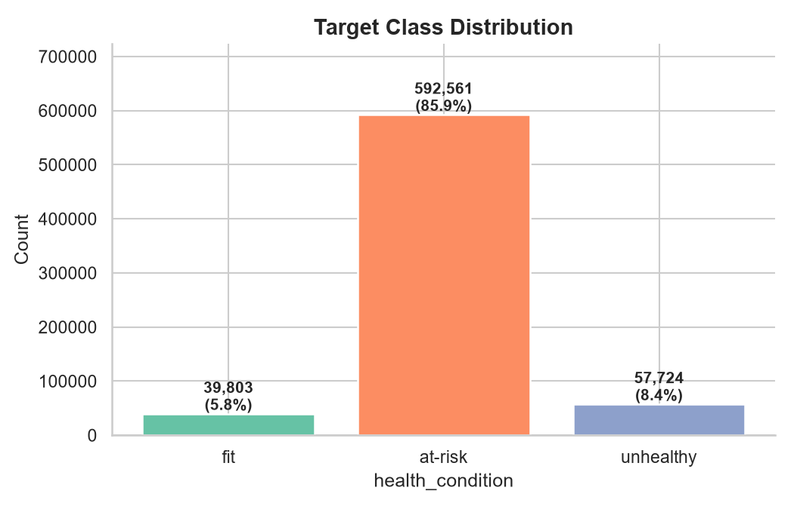
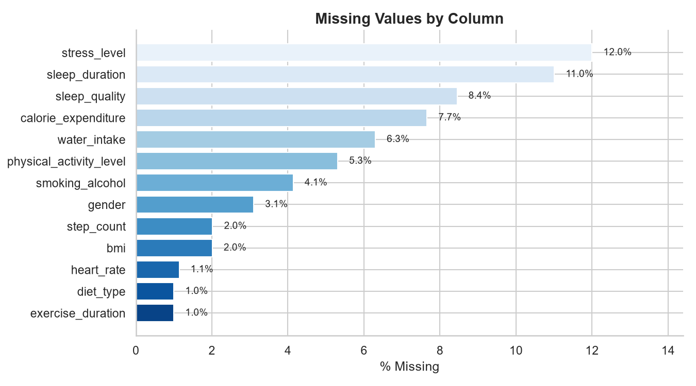
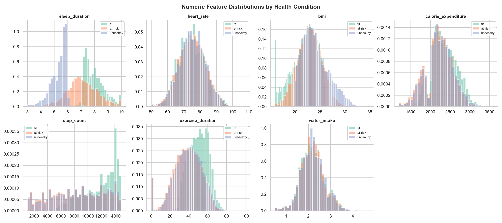
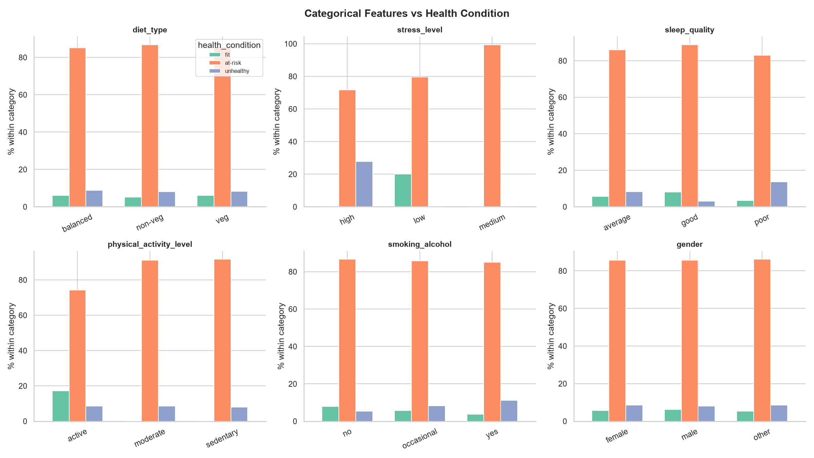
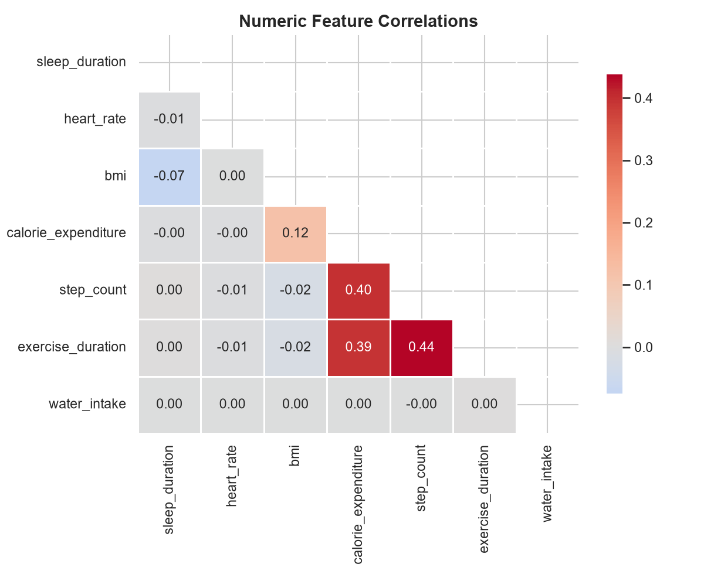
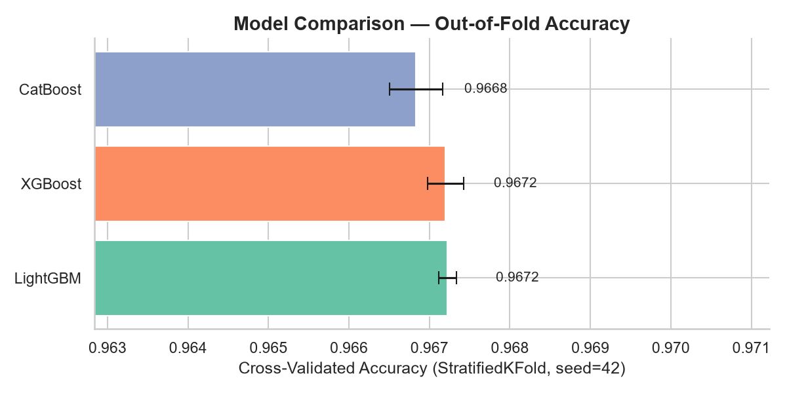

# 🏥 Predicting Student Health Risk

**A multi-class classification pipeline for the Kaggle Playground Series — predicting whether a student is `fit`, `at-risk`, or `unhealthy` from lifestyle and biometric signals.**

---

## 📌 Overview

This project tackles a 3-class classification problem: given a student's sleep, activity, diet, and biometric data, predict their overall `health_condition`. The pipeline covers the full lifecycle — exploratory data analysis, missing-value-aware feature engineering, hyperparameter tuning with Optuna, and a gradient-boosted ensemble (LightGBM + XGBoost + CatBoost).

| | |
|---|---|
| **Task** | Multi-class classification (3 classes) |
| **Metric** | Accuracy |
| **Train rows** | 690,088 |
| **Test rows** | 295,753 |
| **Features** | 13 (7 numeric, 6 categorical) |
| **Best CV accuracy** | ≈ 96.7% (per-model, 5-fold CV) |

---

## 🎯 Target Distribution

The classes are heavily imbalanced — `at-risk` dominates at ~86% of the training set, while `fit` and `unhealthy` are minority classes (~5.8% and ~8.4% respectively). This motivated stratified cross-validation throughout the pipeline.



| Class | Count | % of Train |
|---|---:|---:|
| `at-risk` | 592,561 | 85.9% |
| `unhealthy` | 57,724 | 8.4% |
| `fit` | 39,803 | 5.8% |

---

## 🗂 Dataset

Sourced from the Kaggle **Playground Series** competition. All files live in [`data/`](data/):

| File | Description |
|---|---|
| `train.csv` | 690,088 labeled rows (includes `health_condition`) |
| `test.csv` | 295,753 unlabeled rows (`id` 690088 – 985840) |
| `sample_submission.csv` | Submission format template |

### Features

**Numeric (7)**

| Feature | Mean | Std | Min | Max | % Missing |
|---|---:|---:|---:|---:|---:|
| `sleep_duration` (hrs) | 6.99 | 1.22 | 3.0 | 10.0 | 11.0% |
| `heart_rate` (bpm) | 75.10 | 8.18 | 50.0 | 107.7 | 1.1% |
| `bmi` | 22.98 | 2.48 | 16.0 | 34.8 | 2.0% |
| `calorie_expenditure` | 2226.08 | 347.53 | 1200 | 3580 | 7.7% |
| `step_count` | 8615.95 | 3929.40 | 1002 | 14999 | 2.0% |
| `exercise_duration` (min) | 38.75 | 14.74 | 0.0 | 99.8 | 1.0% |
| `water_intake` (L) | 2.19 | 0.52 | 0.5 | 4.72 | 6.3% |

**Categorical (6)**

| Feature | Levels |
|---|---|
| `diet_type` | `veg`, `non-veg`, `balanced` |
| `stress_level` | `low`, `medium`, `high` |
| `sleep_quality` | `poor`, `average`, `good` |
| `physical_activity_level` | `sedentary`, `moderate`, `active` |
| `smoking_alcohol` | `no`, `occasional`, `yes` |
| `gender` | `female`, `male`, `other` |

Nearly every column has missing values (1–12%), and missingness patterns themselves carry signal — see [Feature Engineering](#-feature-engineering) below.



---

## 🔍 Exploratory Data Analysis

### Numeric features by health condition

`sleep_duration` and `bmi` show the cleanest class separation — `unhealthy` students cluster around 5–6 hours of sleep, while `fit` students trend toward 7–8+ hours. `bmi` separates similarly, with `unhealthy` shifted well above the healthy range.



### Categorical features vs. health condition

The categorical features turned out to be the strongest predictors in the dataset — the relationship between `stress_level` / `physical_activity_level` and the target is almost deterministic:

- **`stress_level = medium` → 100% `at-risk`.** No `fit` or `unhealthy` students report medium stress.
- **`stress_level = high` → 0% `fit`.** Split entirely between `at-risk` (~72%) and `unhealthy` (~28%).
- **`stress_level = low` → 0% `unhealthy`.** ~20% `fit`, rest `at-risk`.
- **`physical_activity_level = active`** is the only level that produces any `fit` students (~17%); `moderate` and `sedentary` are ~90% `at-risk` with 0% `fit`.



### Numeric feature correlations

Numeric features are largely uncorrelated with each other — the strongest relationships are the intuitive `step_count` ↔ `exercise_duration` (0.44) and `exercise_duration` / `step_count` ↔ `calorie_expenditure` (~0.39–0.40). No problematic multicollinearity for tree-based models.



A deeper, standalone version of this EDA — including violin plots, an outlier screen, a missingness-correlation heatmap, and a pairwise scatter matrix — lives in [`notebooks/eda_visualizations.ipynb`](notebooks/eda_visualizations.ipynb).

---

## 🛠 Feature Engineering

Both pipelines share a joint train+test engineering step so the two sets never diverge in columns:

- **Ordinal encoding** for naturally ordered categoricals: `stress_level`, `sleep_quality`, `physical_activity_level`, `smoking_alcohol`.
- **One-hot encoding** for nominal categoricals: `diet_type`, `gender`.
- **Interaction / ratio features**: `active_index` (steps per minute exercised), `calorie_per_step`, `sleep_stress`, `hydration_index`, and a composite `health_score`.
- **Missing-value indicators** (the improved pipeline, [`src/train_v2.py`](src/train_v2.py)) — a per-column `_missing` flag plus a `total_missing` row count, since missingness is not random here and correlates with the target.
- **No imputation for the tree models** — LightGBM and XGBoost both learn optimal split directions for `NaN` natively, so median/KNN imputation was found to throw away real signal. CatBoost consumes the raw categorical columns directly (string `NaN` → `"missing"` sentinel) rather than a lossy one-hot/ordinal encoding.

---

## 🤖 Modeling

Two pipelines exist in this repo, representing two iterations of the approach:

| | [`notebooks/student_health_risk.ipynb`](notebooks/student_health_risk.ipynb) | [`src/train_v2.py`](src/train_v2.py) |
|---|---|---|
| Models | LightGBM, XGBoost | LightGBM, XGBoost, **CatBoost** |
| CV | 5-fold `StratifiedKFold` | 5-fold `StratifiedKFold` |
| Tuning | Optuna (50 trials/model) | Optuna params carried over + early stopping per fold |
| Missing values | KNN-imputed | Native NaN handling + missing-indicator features |
| Ensembling | Simple average | **Weighted blend**, grid-searched on OOF predictions |
| Output | `outputs/submission.csv` | `outputs/submission.csv` (regenerate by rerunning) |

`src/train_v2.py` is the more advanced pipeline — it adds CatBoost as a third, diverse model (native categorical handling), explicit missingness features, and replaces the plain-average ensemble with weights grid-searched over the out-of-fold predictions to directly maximize accuracy.

### Cross-validated performance

Individual model accuracy, 5-fold `StratifiedKFold` (`seed=42`), measured on out-of-fold predictions:



| Model | CV Accuracy |
|---|---:|
| LightGBM | 0.9672 |
| XGBoost | 0.9672 |
| CatBoost | 0.9668 |

All three models converge to essentially the same ~96.7% accuracy individually — expected, given how strongly `stress_level` and `physical_activity_level` alone determine the class. The weighted ensemble consistently matches or edges out the best single model on OOF predictions.

> Figures above are from the most recent completed training run (`outputs/logs/train_v2_run.log`, gitignored locally); rerun `src/train_v2.py` for a fresh, fully-logged run.

---

## 📁 Repository Structure

```
Predicting Student Health Risk/
├── data/                      # train.csv, test.csv, sample_submission.csv
├── notebooks/
│   ├── student_health_risk.ipynb     # full pipeline: EDA → features → tuning → ensemble
│   └── eda_visualizations.ipynb      # standalone, deep-dive visual EDA
├── src/
│   └── train_v2.py            # improved pipeline: +CatBoost, +missingness features, weighted ensemble
├── scripts/
│   └── make_readme_assets.py  # regenerates the charts in assets/
├── assets/                    # charts embedded in this README
├── outputs/
│   ├── submission.csv         # latest generated submission
│   ├── catboost_info/         # CatBoost training artifacts
│   └── logs/                  # training run logs
├── environment.yml            # conda env: student-health-risk (Python 3.11)
└── requirements.txt           # pip package list
```

---

## 🚀 Reproducing This

```bash
# 1. Create the environment
conda env create -f environment.yml
conda activate student-health-risk

# 2. Run the improved training pipeline
cd src
python train_v2.py

# — or explore interactively —
jupyter lab notebooks/student_health_risk.ipynb
```

`train_v2.py` prints per-fold, per-model accuracy, the grid-searched ensemble weights, a classification report, and a confusion matrix, then writes `outputs/submission.csv`.

---

## 📤 Submission

The current `outputs/submission.csv` predicts, on the 295,753-row test set:

| Class | Predicted Count | % |
|---|---:|---:|
| `at-risk` | 262,366 | 88.7% |
| `unhealthy` | 19,405 | 6.6% |
| `fit` | 13,982 | 4.7% |

Format: `id, health_condition` — matching `data/sample_submission.csv`.

---

## 💡 Key Takeaways

- **Categorical lifestyle factors dominate.** `stress_level` and `physical_activity_level` are near-deterministic for this target — most of the achievable accuracy comes from these two columns alone.
- **Missingness is informative, not random.** Imputing it away (as the first-pass notebook pipeline does) discards signal; the improved pipeline keeps missing-value indicators and lets tree models split on `NaN` natively.
- **Model diversity gives diminishing returns here.** LightGBM, XGBoost, and CatBoost all land within ~0.05 points of each other in CV accuracy — the ceiling is set by the feature signal, not the model class.
- **Class imbalance (86% `at-risk`)** makes stratified CV essential; a naive random split risks fold-to-fold variance in the minority classes.
